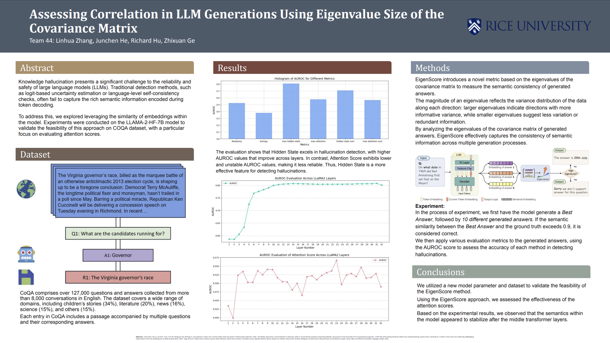

## Readme 

This is the github repository for Rice University ELEC 576 Project.

It's our poster the project.

### Quick Start

0.run `conda env create -f environment.yml`, use environmental.yml to install the environment of the project.

1. run `sh run.sh` to install the weight of model 

2. run `python main.py --model meta-llama/Llama-2-7b-hf  --dataset coqa --device cuda --num_generations_per_prompt 10` to run the experiment of our poster

3. run `python eval_main.py --model meta-llama/Llama-2-7b-hf --dataset coqa  --device mps --num_generations_per_prompt 10`
and `python eval_attention_main.py --model meta-llama/Llama-2-7b-hf --dataset coqa  --device mps --num_generations_per_prompt 10` to get result of the project.

### Result of the project

AUROC-Perplexity: 0.5230299187604817
AUROC-Energy: 0.38034706147511493
AUROC-EigenIndicator_All_Layers: 0.7090956158194162
AUROC-EigenIndicatorOutput_Seperate_Layers_0: 0.5277091195449853
AUROC-EigenIndicatorOutput_Seperate_Layers_1: 0.5867388757735996
AUROC-EigenIndicatorOutput_Seperate_Layers_2: 0.586102732881673
AUROC-EigenIndicatorOutput_Seperate_Layers_3: 0.6056517737649636
AUROC-EigenIndicatorOutput_Seperate_Layers_4: 0.6336094303289126
AUROC-EigenIndicatorOutput_Seperate_Layers_5: 0.7245108155945441
AUROC-EigenIndicatorOutput_Seperate_Layers_6: 0.7684746757170708
AUROC-EigenIndicatorOutput_Seperate_Layers_7: 0.7757645251979555
AUROC-EigenIndicatorOutput_Seperate_Layers_8: 0.7832990270929435
AUROC-EigenIndicatorOutput_Seperate_Layers_9: 0.7902470313461197
AUROC-EigenIndicatorOutput_Seperate_Layers_10: 0.7995635568747329
AUROC-EigenIndicatorOutput_Seperate_Layers_11: 0.8028800771202834
AUROC-EigenIndicatorOutput_Seperate_Layers_12: 0.8051409948410893
AUROC-EigenIndicatorOutput_Seperate_Layers_13: 0.8060339101142834
AUROC-EigenIndicatorOutput_Seperate_Layers_14: 0.8071694578070535
AUROC-EigenIndicatorOutput_Seperate_Layers_15: 0.8068008088058088
AUROC-EigenIndicatorOutput_Seperate_Layers_16: 0.8061483505734686
AUROC-EigenIndicatorOutput_Seperate_Layers_17: 0.8056786241537581
AUROC-EigenIndicatorOutput_Seperate_Layers_18: 0.8045814563570082
AUROC-EigenIndicatorOutput_Seperate_Layers_19: 0.8043726976918144
AUROC-EigenIndicatorOutput_Seperate_Layers_20: 0.8042821087064718
AUROC-EigenIndicatorOutput_Seperate_Layers_21: 0.803996279480849
AUROC-EigenIndicatorOutput_Seperate_Layers_22: 0.8044716774236556
AUROC-EigenIndicatorOutput_Seperate_Layers_23: 0.8044260721625952
AUROC-EigenIndicatorOutput_Seperate_Layers_24: 0.8045496025971535
AUROC-EigenIndicatorOutput_Seperate_Layers_25: 0.8049496392056699
AUROC-EigenIndicatorOutput_Seperate_Layers_26: 0.8051537363450312
AUROC-EigenIndicatorOutput_Seperate_Layers_27: 0.8058420106341835
AUROC-EigenIndicatorOutput_Seperate_Layers_28: 0.8061574405488419
AUROC-EigenIndicatorOutput_Seperate_Layers_29: 0.8064279644313148
AUROC-EigenIndicatorOutput_Seperate_Layers_30: 0.806543958732444
AUROC-EigenIndicatorOutput_Seperate_Layers_31: 0.8078314721673501
AUROC-EigenIndicatorOutput_Seperate_Layers_32: 0.8008837009904655
AUROC-LexicalSim: 0.7741647283783282
AUROC-SentBertScore: 0.5
AUROC-EigenScore: 0.8061483505734686
AUROC-EigenScore-Output: 0.8255218073170728
rho_Perplexity: -0.05035556758507169
rho_Energy: -0.2791229673966662
rho_LexicalSimilarity: 0.46993017110374113
rho_EigenScore: 0.5328488728391713
rho_EigenScoreOutput: 0.5431588321650521